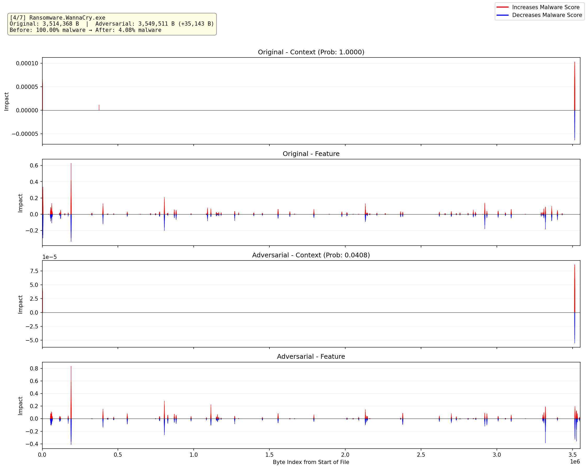

# x-MalConv2

An explainable malware detection system built on **MalConvGCT**. We implemented DeepSHAP-style per-byte attribution using **Integrated Gradients** — an approximation based on integral calculus that satisfies the completeness axiom. The system visualizes byte-level contribution graphs **before and after adversarial padding attacks**, making it easy to observe how the model's decision shifts.

## How to Read the Graphs

Each graph shows per-byte attribution across the entire binary file:

- **X-axis** — Byte index (position in the file)
- **Red bars** — Bytes that contribute toward **malware** classification
- **Blue bars** — Bytes that contribute toward **benign** classification
- **Baseline** — Model output when all input bytes are zero (i.e., zero-embedding reference)

The orange highlighted region in post-attack graphs marks the **adversarial padding** appended to the original file.

All parameters (number of IG steps, attack iterations, target class, etc.) can be configured in `config/config.yaml`.

### Example Output



---

## Sources

### Model

[MalConv2 — FutureComputing4AI](https://github.com/FutureComputing4AI/MalConv2)

Pre-trained checkpoint and model code are located in `models/MalConv2-main/`.

### Data

PE malware samples from: [theZoo — ytisf](https://github.com/ytisf/theZoo)

`data.zip` password: `xMalConv-2026`

> [!CAUTION]
> ⚠️ **`data.zip` contains real malicious PE executables. Use for research purposes only.**
>
> The Docker image (`wjm9765/xmalconv2`) already includes `data.zip`.

---

## Usage

### Option 1: Docker Hub (Recommended)

```bash
docker pull wjm9765/xmalconv2:latest
docker run -p 8501:8501 wjm9765/xmalconv2:latest
```

Open `http://localhost:8501` in your browser.

### Option 2: Git Clone

```bash
git clone https://github.com/wjm9765/x-MalConv2.git
cd x-MalConv2
uv sync
./scripts/run_xMalconv
```

To analyze a single file:

```bash
./scripts/run_xMalconv data/Locky
```

Open `http://localhost:8501` in your browser.

---

## Project Structure

| Path | Description |
|------|-------------|
| `src/` | Source code (Streamlit app, IG explainer, adversarial attack) |
| `models/MalConv2-main/` | MalConvGCT model code and checkpoint |
| `config/config.yaml` | Hyperparameters for model, attack, and explainability |
| `scripts/run_xMalconv` | Entry script (extract data → launch Streamlit) |
| `data.zip` | Malware samples (password-protected) |

---

## References

- Kolosnjaji et al., [*Adversarial Malware Binaries: Evading Deep Learning for Malware Detection in Executables*](https://arxiv.org/abs/1803.04173)
- Lundberg & Lee, [*A Unified Approach to Interpreting Model Predictions (SHAP)*](https://arxiv.org/abs/1705.07874)
- Raff et al., [*Classifying Sequences of Extreme Length with Constant Memory Applied to Malware Detection*](https://arxiv.org/abs/2012.09390)
